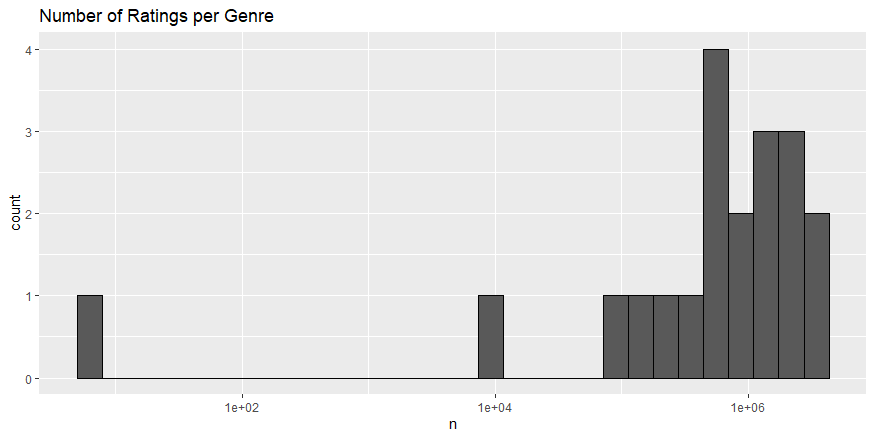
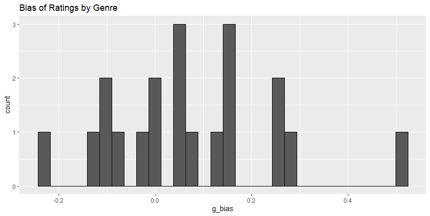
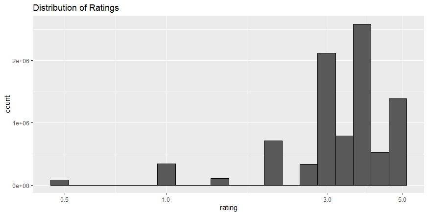
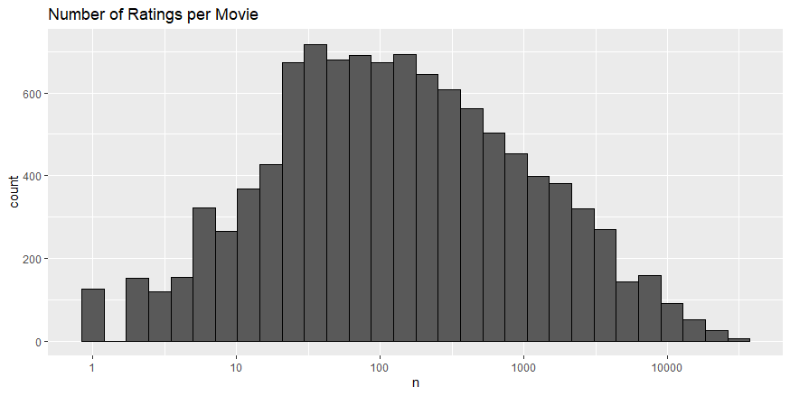
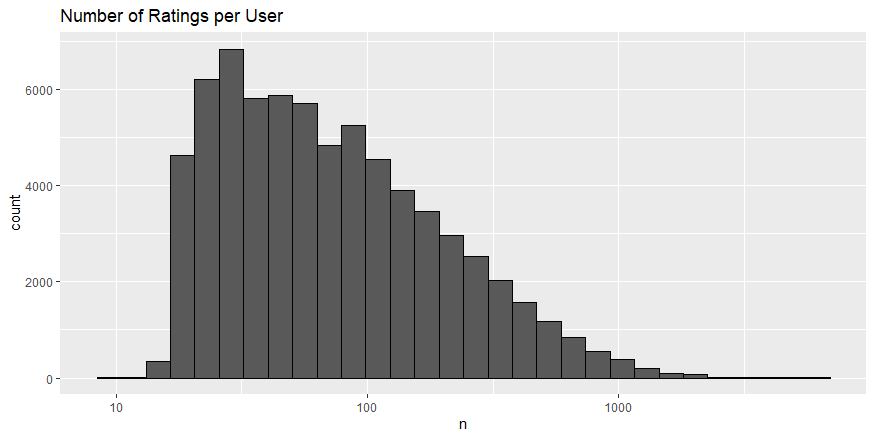
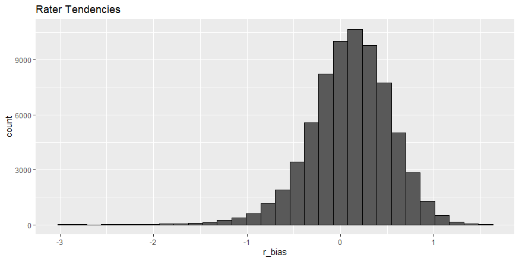
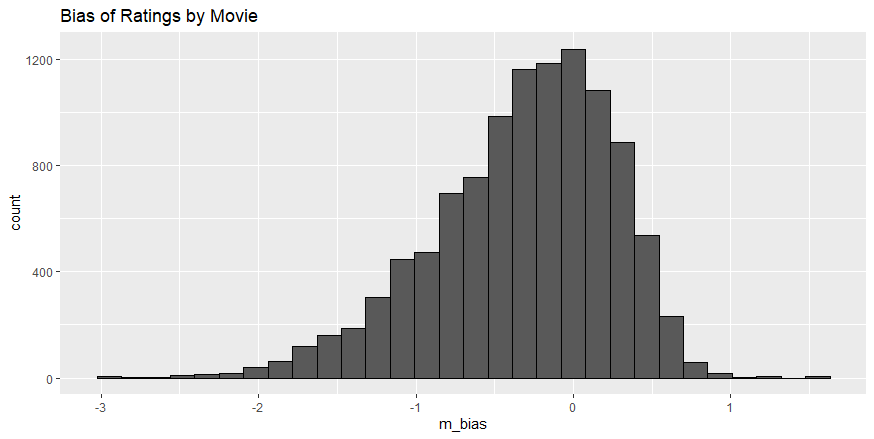
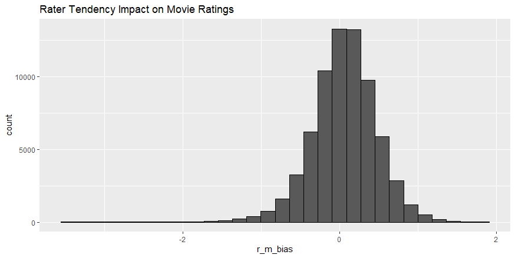

# Introduction/Overview/Executive Summary

The goal of the the HarvardX PH125.9x Data Science Capstone Project is to create a movie recommendation system by training a machine learning algorithm using the MovieLens dataset. The dataset consists of 10 million ratings and 100,000 tag applications applied to 10,000 movies by 72,000 users. It can be found at: https://grouplens.org/datasets/movielens/.

The specific task is to train a machine learning algorithm using the inputs from a subset named "edx," consisting of slightly more than 9 million ratings, or 90% of the full set.  Then, by using the optimum algorithm, predict movie ratings in the testing set named "validation" made up of the remaining 10%. Grades will be awarded based on the final Root Mean Square Error (RMSE) with full points for any results lower than 0.86490. 

I performed the key steps learned during the course to accomplish the goal. The steps included exploring the data to understand its structure, visualizing the data to uncover distributions and biases, developing algorithms to satisfy the goal, then testing it to ensure its validity.  

In the end, I developed an algorithm that resulted in an RMSE of 0.8567 on the training set and fared slightly worse on the validation set with a final RMSE of 0.8653.


# Methods/Analysis 

The instructor provided the initial code to ingest, wrangle, and prepare the data from the GroupLens research lab.  The code produced two data frames: "edx" and "validation" with columns formatted for ease of use.  For example, every movie had its own ID and the given code converted it to a numeric value.

My first step was to explore and visualize the data.  I learned from Part 1 of the exercise that some genres received many more ratings than others.  One problem with the data set was that many movies were categorized in several different genres.  To overcome this challenge, I had to separate the rows so that there was only a single genre.  After that, I created a histogram and discovered two of the twenty genres received significantly  fewer ratings than the others.  The remaining genres all received over 100,000 ratings with seven receiving over 1 million ratings.

```{r, out.width='100%', fig.align='center', fig.cap='*Graph reflects the number of ratings (n) per genre. One genre received less than 100 ratings, one genre received 1,000 ratings, while the majority centered around 1 million ratings*', echo=FALSE}

```

This distribution meant that while at least two of the genres lacked sufficient sample size, there was evidence that the majority of genres received enough ratings to potentially influence a learning algorithm based on genre alone.  My next step was to evaluate any biases based on genre.  For example, would more viewers of comedy provide ratings higher than average?  To see this, I prepared a histogram showing the distribution of ratings by genre compared to the overall average rating of approximately 3.5.  In fact, about 14 of the 20 genres received ratings higher than the average.

```{r, out.width='100%', fig.align='center', fig.cap='*Graph reflects how the average rating per genre compares to the overall average rating. About 35% of the genres were rated below average.*', echo=FALSE}

```

I also learned from Part 1 of the exercise that some ratings were more common than others.  For instance, there were more ratings of '3' than there were of '1' as shown below:

```{r, out.width='100%', fig.align='center', fig.cap='*Graph reflects the overall distribution of rating scores.*', echo=FALSE}

```

Knowing this, it would seem logical that low ratings would impact the overall rating of certain movies if they also received fewer ratings.  To see how many movies were subject to this problem, I prepared a histogram to show how the number of ratings per movie.  This distribution seemed generally standard with the majority of the movies receiving between 50-500 ratings.  There were, however, about 160 movies that only received one rating.

```{r, out.width='100%', fig.align='center', fig.cap='*Graph reflects count of movies and number (n) of ratings.  About 160 movies received only one rating.*', echo=FALSE}

```

Following this logic, it also seemed understandable that ratings could be skewed if only a few raters were submitting most of the ratings.  By exploring this distribution I found that the majority of users submitted under 100 ratings but some submitted over 1,000.

```{r, out.width='100%', fig.align='center', fig.cap='*Graph reflects count of users and number (n) of ratings.*', echo=FALSE}

```

Clearly, there is evidence to show that a smaller subset of the total rater population rates many more movies than others and therefore, can skew ratings based on their personal tendencies.  To see how the rater tendencies lie, I prepared a histogram to show the distribution of ratings by rater compared to the overall average rating of approximately 3.5.  Interestingly, the results skewed toward positive ratings.

```{r, out.width='100%', fig.align='center', fig.cap='*Graph reflects count of users and bias of ratings (r_bias).*', echo=FALSE}

```

Next, I wanted to explore and see if there was a bias toward favorable or unfavorable ratings based on certain movies.  To accomplish this, I prepared a histogram showing the distribution of ratings by movie compared to the overall average rating of approximately 3.5.  The results were different than the rater tendencies in that they skewed toward negative ratings.

```{r, out.width='100%', fig.align='center', fig.cap='*Graph reflects count of movies and bias of ratings (m_bias).*', echo=FALSE}

```

The final exploration I performed was to delve deeper into the impact rater tendencies had on overall movie ratings.  Here, I combined the rater and movie biases to see if it would result in a more normal distribution around the overall average rating.  The resulting histogram shows that indeed it is a normal distribution centered on the overall average.

```{r, out.width='100%', fig.align='center', fig.cap='*Graph reflects bias of ratings when both rater and movie biases are factored in.*', echo=FALSE}

```

Once I found a good balance of factors that provided a standard distribution around the overall average, I felt it was sufficient to move forward developing algorithms to predict movie ratings.

I experimented with five different models to see which would result in the lowest RMSE based on the training set, "edx."  

* Model 1: Naive Method Using Only Mean Rating.  This model took only the mean rating, mu, to see if it would produce a suitable RMSE.
* Model 2: Effect of Genre Bias.  This model considered the effect the genre bias had on the result since 14 of the 20 genres received ratings higher than the average.
* Model 3: Effect of Movie Bias.  This model considered the effect the movie bias had on the result since ratings skewed toward negative ratings.
* Model 4: Effect of Rater Bias.  This model considered the effect the rater bias had on the result since ratings skewed toward positive ratings.
* Model 5: Effect of Combined Movie and Rater Bias.  This model considered the effect the combination of movie and rater bias had since the former skewed negative while the latter skewed positive.

# Results 

The different models produced RMSE value with a range of 0.2103.  I expected Model 1 to perform the worst since it only considered the overall mean rating.  While it did perform poorly, it was surprisingly not as bad as Model 2 that predicted ratings based on genre.  This may be because the genre biases were widely distributed with no real symmetry so could not be considered reliable in predicting future ratings.

Model 3 performed only slightly better than Model 4 showing that the biases by movie were only moderately less impactful than biases by rater.  In the end, Model 5 that combined the biases between movies and raters proved to be the best in the training set.  The overall RMSE results are shown below:

Model | RMSE
------|------
Model 1: Naive | 1.0603
Model 2: Genre | 1.0670
Model 3: Movie | 0.9423
Model 4: Rater | 0.9700
Model 5: Movie + Rater | 0.8567

The final step was to take the best model and apply it to the test set, "validation," and see the results.  In order to score the maximum points for this project, I needed to produce an RMSE of less than 0.86490.  When I applied my best model, Model 5, to "validation" it resulted in a final RMSE of 0.8653.

# Conclusion 

The goal of the the HarvardX PH125.9x Data Science Capstone Project was to create a movie recommendation system by training a machine learning algorithm using the MovieLens dataset.  I applied what I learned during the course to explore the data so I could understand its structure, visualize the data to uncover distributions and biases, develop algorithms to satisfy the goal, then test it to ensure its validity.  While I did not earn maximum points, I did learn much about performing a data science project start-to-finish with a large data set.  

I could find no limitations to this project other than my own inexperience.  Over time, I am confident I will continue to improve my skills and hopefully, return to this project to continue future work.  One specific area for future work will be to consider how ratings may have changed over time.  For example, would a movie released in 1992 have received better ratings that year or ten years later?  Another area for future work will be to incorporate other data not found in this data set such as the state of the economy on ratings.